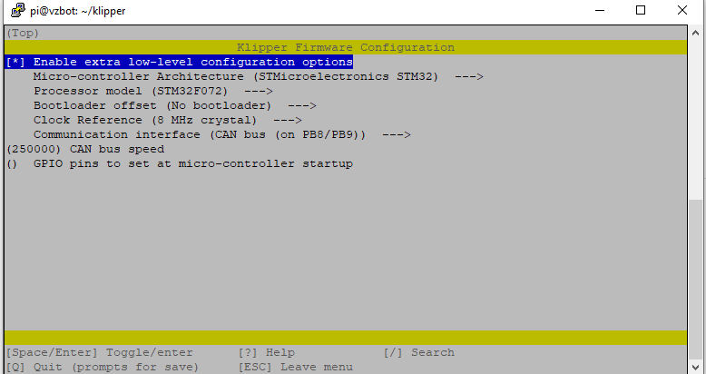
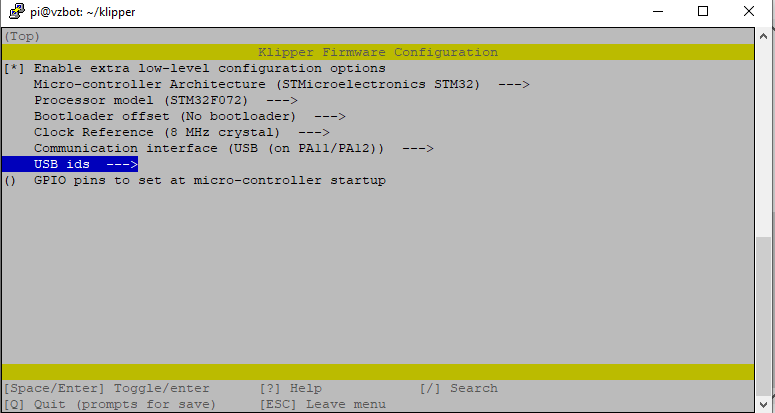

# HowTo for configuring the Mellow SHT-36 and SHT_42 CANBUS tool boards for Klipper. 


**This guide assumes you alreay have a working Klipper installation**

## Setup Steps

### Compile Toolboard Firmware
- ssh to your pi console
- CD to the klipper directory
```
cd klipper
```
- Run MAKE Clean
```
make clean
```
- open menuconfig
```
make menuconfig
```
- Set the following options for CANBUS connection     


- Set the following for USB Connection

- compile the firmware
```
make
```
- You should now have a klipper.bin file at ~/klipper/out/

### Burn Firmware to Tool Board

- Install the boot jumper to the Boot0 pin and 3.3v pin as pictured. 


- Install the burning utility to your klipper host system
```
sudo apt install dfu-util -y
```
- Use USB-C data cable to connect the SHT board to the klipper host, Make sure that the jumper is installed before connecting the USB cable.      
- Run LSUSB to see if the connection is successful, copy the USB ID in the blue box. Note that the board is in DFU mode. 
```
lsusb
```


- Burn the firmware , replace 0483:df11 in the following command with the USB ID copied earlier
```
dfu-util -a 0 -d 0483:df11 --dfuse-address 0x08000000 -D ~/klipper/out/klipper.bin
```

- You should get a download progress bar and File downloaded successfuly when the burning is complete. 


- If the burn was sucessful remove the USB cable and the jumper from the Boot0 pin
- The tool board is now ready to install as a klipper MCU. 
**Repeat these steps if a klipper update requires flashing new firmware to the MCU. 


### Klipper Host configuration

- Klipper Host configuration
- Create a new file named /etc/network/interfaces.d/can0 with the following contents or read below to download a copy. 
```
auto can0
iface can0 can static
    bitrate 250000
    up ifconfig $IFACE txqueuelen 1024
```
 A copy of this file can be downlaoded [here](./can0). SFTP this file to your Klipper host /home/pi directory and run this line from the ssh console to move it to the correct directory.
```
sudo cp /home/pi/can0 /etc/network/interfaces.d/
```
 - Waveshare RP485 CAN Hats will need further configuration - More on this section soon.       
    [Waveshare instructions](https://www.waveshare.com/wiki/RS485_CAN_HAT)      

- Klipper CANBUS configuration
 - Finding the canbus_uuid for new micro-controllers¶
  Each micro-controller on the CAN bus is assigned a unique id based on the factory chip identifier encoded into each micro-controller. To find each micro-controller     device id, make sure the hardware is powered and wired correctly, and then run:


```
~/klippy-env/bin/python ~/klipper/scripts/canbus_query.py can0
```
  If uninitialized CAN devices are detected the above command will report lines like the following:


```
Found canbus_uuid=11aa22bb33cc
```
  Each device will have a unique identifier. In the above example, 11aa22bb33cc is the micro-controller's "canbus_uuid".

   Note that the canbus_query.py tool will only report uninitialized devices - if Klipper (or a similar tool) configures the device then it will no longer appear in      the list.

 - Configuring Klipper¶
  Update the Klipper mcu configuration to use the CAN bus to communicate with the device - for example:

Add the following lines to your printer.cfg file using your canbus_uuid
```
[mcu sht36]
canbus_uuid: 11aa22bb33cc
```
 - more needed here for configuring Can bus network settings. 

- USB Configuration
    - Run the following command at the Klipper host SSH console to get the serial path for the SHT board.
```
ls -l /dev/serial/by-id/
```
    - Note the ID containing 'stm32f072xb'

Add the following lines to your printer.cfg file replacing the USB ID with the one you copied in the last section. 
```
[mcu sht36]
serial: /dev/serial/by-id/usb-Klipper_stm32f072xb_240024001757425835303220-if00
```

Impoprtant: THe SHT-36 has 120 ohm jumpers. If you board is the last device on the CAN bus it needs to have the jumpers installed.       
THe CANBUS needs to red 60 ohms across the L and H wires.       


### Flashing UTOC
```sudo dfu-util --dfuse-address -d 0483:df11 -c 1 -i 0 -a 0 -s 0x08000000 -D ~/CanBoot//utoc/utoc_firmware.bin```      
[Mellow UTOC firmware](./firmware/UTOC/utoc_firmware.bin)
Note to self: Add notes on jumpers and file location


## Relevent links      
### Mellow tool board documentation      
https://mellow.klipper.cn/?spm=a2g0o.detail.1000023.17.566a6b5carjmy3#/board/fly_sht36_42/pins      

### Pin assignments      
https://mellow.klipper.cn/?spm=a2g0o.detail.1000023.17.566a6b5carjmy3#/board/fly_sht36_42/pins      

### Mellow Schematics        
https://github.com/Mellow-3D/Klipper-CAN-Toolboards      

### Mellow CAN Advanced Settings
https://mellow.klipper.cn/?spm=a2g0o.detail.1000023.17.566a6b5cQK0pdg#/advanced/can

### Mellow CANBoot setup
https://mellow.klipper.cn/?spm=a2g0o.detail.1000023.17.566a6b5cQK0pdg#/advanced/canboot

### Klipper CANBUS Documentation     
https://www.klipper3d.org/CANBUS.html      

### Waveshare RS485 CANHAT
https://www.waveshare.com/wiki/RS485_CAN_HAT

### Kevin O'Conner Experemental USB to CANBUS bride mode discussion. _ Recently merged into the main Klipper branch. Allows using compatible MCUs like the Octopus as your CANBUS node for the Klipper host. No USB CAN Interface or Pi HAT needed. 
https://klipper.discourse.group/t/experimental-usb-to-canbus-bridge-mode/3136

### Maz0r CanBus troubleshooting
https://maz0r.github.io/klipper_canbus/controller/candlelight_fw.html#httpscanableioupdater

### CANBoot by Arksine
https://github.com/Arksine/CanBoot


